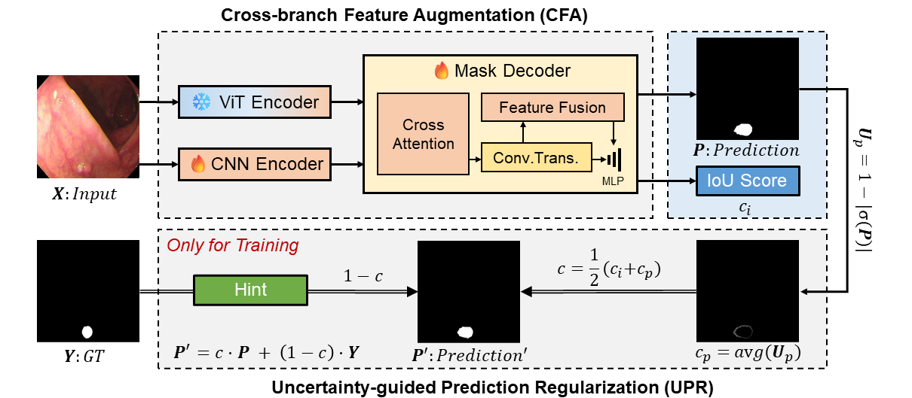
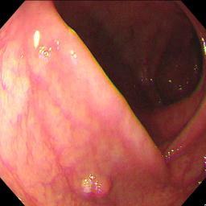

# [ASPS: Augmented Segment Anything Model for Polyp Segmentation](https://arxiv.org/abs/2407.00718)

### News

2025/2/22: Add code for SAM2.

2024/6/25: 🎉Our method was accepted by **MICCAI 2024**.

2024/5/21: Add data loader for Skin Lesion Segmentation (ISIC2017).



### Requirements

Install the dependencies of [SAM](https://github.com/facebookresearch/segment-anything).

Install mmcv-full for CNN encoder. 

```shell
conda create --name ASPS python=3.8
conda activate ASPS
pip install torch==1.12.1+cu116 torchvision==0.13.1+cu116 torchaudio==0.12.1 --extra-index-url https://download.pytorch.org/whl/cu116
pip install mmcv-full==1.6.2 -f https://download.openmmlab.com/mmcv/dist/cu116/torch1.12/index.html

pip install tqdm
pip install opencv-python
pip install albumentations==1.3.0
```

### Dataset

We conduct extensive experiments on five polyp segmentation datasets
following [PraNet](https://github.com/DengPingFan/PraNet). 

>  For skin lesion segmentation: following [EGE-UNet](https://github.com/JCruan519/EGE-UNet), needing to modify `from dataset.Segmentation_other` to `from dataset.Segmentation_isic` both in `train.py` and `infer.py`.

### Training 

We used `train.py` to train our framework. 

The `--exp_name` is the name of the experiment, and `--polyp_dir` is the path to the training dataset.

```bash
python train.py --exp_name '0308_E_L' --polyp_dir "polyp_seg/TrainDataset/"
```

### Evaluating

We used  `infer.py` to evaluate our framework. 

The `--dataset_name` is the name of the dataset, and `--test_seg_dir` is the path to the testing dataset.

```shell
python infer.py --exp_name '0308_E_L' --dataset_name 'CVC-300'  --test_seg_dir "polyp_seg/TestDataset/CVC-300/"   
python infer.py --exp_name '0308_E_L' --dataset_name 'CVC-ClinicDB'  --test_seg_dir "polyp_seg/TestDataset/CVC-ClinicDB/"   
python infer.py --exp_name '0308_E_L' --dataset_name 'CVC-ColonDB'  --test_seg_dir "polyp_seg/TestDataset/CVC-ColonDB/"   
python infer.py --exp_name '0308_E_L' --dataset_name 'ETIS-LaribPolypDB'  --test_seg_dir "polyp_seg/TestDataset/ETIS-LaribPolypDB/"   
python infer.py --exp_name '0308_E_L' --dataset_name 'Kvasir'  --test_seg_dir "polyp_seg/TestDataset/Kvasir/"  
```

You can directly run the `train.sh` to train and evaluate our framework. 

**Note**: If using SUN_SEG dataset, the training and evaluating codes are in `'scripts/'`.

### Visualize and Inference

To inference single image or visualize the results, run `vis.py`.

|     raw image      |     pred mask      |         GT         |
| :----------------: | :----------------: | :----------------: |
|  |  |  |

### Checkpoints

Note: [Baidu](https://pan.baidu.com/s/1v61ml0k5yJFjQdlYT8CZTw?pwd=9myy)(9myy)
| Name              | Repo                                                         | Download                                                     | Password |
| ----------------- | ------------------------------------------------------------ | ------------------------------------------------------------ | -------- |
| MSCAN-B           | [SegNeXt](https://github.com/visual-attention-network/segnext) | https://rec.ustc.edu.cn/share/4c1d2ab0-344e-11ef-b416-0bee023cca0f | 31tz     |
| MSCAN-L           | [SegNeXt](https://github.com/visual-attention-network/segnext) | https://rec.ustc.edu.cn/share/18e3cd80-344e-11ef-bbf4-79b40a1f9d5c | pl1v     |
| SAM-B-ASPS        |                                                              | https://rec.ustc.edu.cn/share/5e9be4b0-344a-11ef-a151-6b2a0b8eedb8 | li92     |
| SAM-H-ASPS        |                                                              | https://rec.ustc.edu.cn/share/fc3da400-344a-11ef-b1d5-932017a40fd5 | 3w0g     |
| EfficientSAM-ASPS | [EfficientSAM](https://github.com/yformer/EfficientSAM)      | https://rec.ustc.edu.cn/share/c9696fb0-344a-11ef-b24f-3f1e0faf0fb9 | xoqh     |
| SAM2              | [SAM2](https://github.com/facebookresearch/sam2/)            |                                                              |          |

### Citation
```
@InProceedings{Li_ASPS_MICCAI2024,
        author = { Li, Huiqian and Zhang, Dingwen and Yao, Jieru and Han, Longfei and Li, Zhongyu and Han, Junwei},
        title = { { ASPS: Augmented Segment Anything Model for Polyp Segmentation } },
        booktitle = {proceedings of Medical Image Computing and Computer Assisted Intervention -- MICCAI 2024},
        year = {2024},
        publisher = {Springer Nature Switzerland},
        volume = {LNCS 15009},
        month = {October},
        page = {118 -- 128}
}
```
